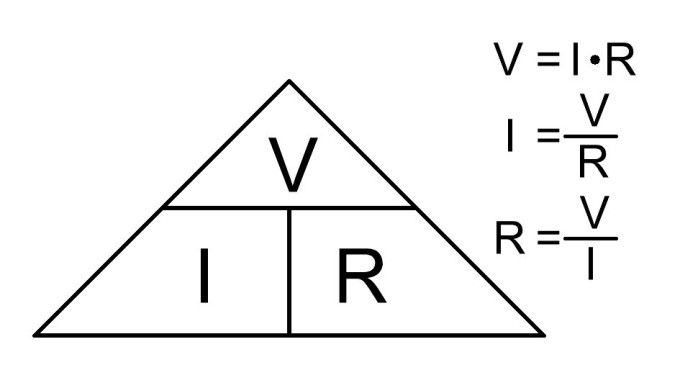
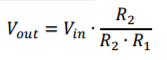

Title: LDR light sensor tutorial
Date: 2016-11-20
Category: Blog
Tags: Arduino, Tutorials, LDR, light sensor
Author: Blaž Pongrac
email: blaz@pongrac.com


<div class="container-fluid">
<div class="row">
    <div class="col-sm-4">
    <p></p>
    </div>
    <div class="col-sm-8">
        <p><h5>Recently I received a question from a good friend of mine. He wanted to automate blinds on his office window and he wondered how he can measure or detect light. I told him that the simplest solution would be using LDR resistor.</h5></p>
        <p><h5>Light Dependent Resistor, also called photoresistor, is resistor with variable resistance, which depends on illumination. First let us take on the basics of the resistors and then basics of the LDR. After that we can move to LDR light sensor and simple Arduino example.</h5></p>
    </div>
</div>


<div class="row">
    <div class="col-sm-8">
        <p><h5>Resistance is characteristic of a material that is resisting the flow of electricity. Basically what that mean is that the higher the resistance, less current can go through the material. This can be well described with the image below.</h5></p>  
    </div>
    <div class="col-sm-4">
        <p></p>
    
    </div>
</div>


<div class="row">
    <div class="col-sm-4">
        <p>
    </div>
    <div class="col-sm-8">
        <p><h5>Voltage or difference in potential is pushing charge carriers (current flow) through the medium and resistance is the “opposite” force of voltage – it is trying to stop them from flowing.</h5></p>
        <p><h5>Resistance (R in image to the left) is defined by Ohm Law. Ohm’s Law is link between electrical voltage (V in image bellow) and electrical current (I in image bellow) and it is one of the basic laws in electronics.</h5></p>
    </div>
</div>


<div class="row">
    <div class="col-sm-12">
      <p><h5>Resistor is one of 4 basic passive elements. Passive elements are all of the elements that cannot amplify or produce energy by themselves (resistor, capacitor, coil and ideal transformer). Resistors main characteristic is resistance (as described above). It is used for current limiting (as on LEDs), voltage drops, voltage dividers, etc. It is one of the most common elements in DC circuits.</h5></p>
    </div>
</div>


<div class="row">
    <div class="col-sm-8">
    <p><h5>LDR resistor is a type of resistor which has a variable resistance – its resistance is changing according to the illumination. If lamination is getting higher, resistance is getting lower. Because LDR is sensitive to broad spectrum of light, it can be used for measuring intensity of the light.</h5> </p>
    </div>
    <div class="col-sm-4">
        <p>
    </div>
</div>


<div class="row">
    <div class="col-sm-4">
        <p>
    </div>
    <div class="col-sm-8">
       
       <p><h5>So far we’ve managed without the math. From now on we will have to do some. On picture bellow there is significant LDR sensor schematic, which is actually voltage divider. </h5></p>
    </div>
</div>

<div class="row">
    <div class="col-sm-12">
        <p><h5>For sake of argument let’s say that LDR resistor (upper element in left picture) has a resistance of R1 (which is changing according to the illumination) and the lower one has the resistance of R2. Combined resistance is then R = R1+R2.</h5></p>
        <p><h5>What I want to explain to you is current limiting and voltage drop. Let us first deal with the currents. Arduino can manage currents in range of few 10 mA, which is not a lot. To have lower power consumption of the LDR sensor circuit, combined resistance R should always be higher than 10 kOHM (with 10 kOHM combined resistance and 5V drop on it, current will be around 0.5 mA).</h5></p>
    </div>
</div>

<div class="row">
    <div class="col-sm-4">
        <p>
    </div>
    <div class="col-sm-8">
       <p><h5>Now let’s move to the voltage drop part. Both resistors, R1 and R2, have some voltage drop on it. If LDR change its value according to illumination, voltage drop is redistributed accordingly. Output voltage of voltage divider is always measured between both resistors and 0V potential (GND). That means one is actually measuring voltage drop on resistor R2. Output voltage can be calculated with: </h5></p>
    </div>
</div>

<div class="row">
    <div class="col-sm-12">
        <p><h5>Where Vin = 5V in case of Arduino. With changing R1 with illumination, output voltage is changed. To set the value of R2 resistor, one must know LDR resistance range (what resistance in dark and what in full illumination). That is usually from around 3k (illuminated) and 1MOHM (in dark). </h5></p>
        <p><h5>Let’s say R2 = 10kOHM for now. If sensor is in dark, Vout is close to the 0V potential, because dividing ratio is very low (denominator is very high according to the numerator). If sensor is well illuminated, dividing ratio is very high (nominator and denominator are very close to each other) and Vout is close to the Vin. Because 10kOHM resistor limits the current and it works great in dividing ratio, R2 must be set to that value</h5></p>
        <p><h5>To determine true value of the R2 resistor, one should measure range of his LDR resistor. That can be done with simple multimeter and simple experiment: resistance is measured when LDR is under light source and resistance is measured when LDR is covered or is in dark space. Resistance can be measured ohmmeter (you can get multimeter for few bucks in your local hardware store).</h5></p>
    </div>
</div>

<div class="row">
    <div class="col-sm-12" "small">
        <p><h5>We’ve seen above that LDR sensor have an analog output. Also we can see that Vout voltage is rising with illumination. We can use this to measure light intensity. Because of the nature of LDR, this measurement is not reliable and it is not something that can be transformed into luminous intensity meter. So the main use for it is to create a light detector. This is fairly simple: analog value is measured and then compared to the desired reference value. If measured value is higher than reference, light was detected (LED on). If measured value is lower than reference value, light is absent from LDR surroundings (dark is detected, LED off). For testing this code you’ll need: Arduino Uno, LDR resistor and 10k OHM resistor. Connect as in schematics above - Vin to 5V, Vout to A0 and ground to GND.</h5> </p>
    </div>
</div>

<center><iframe width="560" height="315" src="https://www.youtube.com/embed/zfpYheCEqbc" frameborder="0" allowfullscreen></iframe></center>

<h4>Arduino Code</h4>

```
void setup() {
  pinMode(13,OUTPUT); // there is onboard LED connected to pin 13
  digitalWrite(13,LOW); // set initial value to 0
  Serial.begin(9600); // begin serial interface; use it to see what values is Arduino reading from LDR sensor
}

void loop() {
  unsigned int value = analogRead(A0); // read analog value from pin A0
  Serial.println(value); // print it to serial monitor; this is for monitoring the value from sensor
  if(value>400){ // if light is detected, set LED
    digitalWrite(13,HIGH);
  }else{ // if light is not detected, reset LED
    digitalWrite(13,LOW);
  }
  delay(1000); // short delay, not needed but is convenient
}
```
</div>
