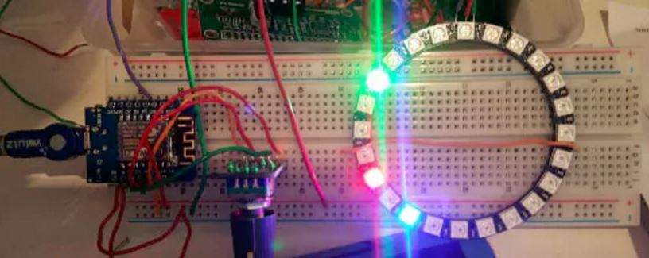

Title: Neo-Pixel Ring Clock - ESP8266 Controlled
Date: 2016-12-08
Category: Blog
Tags: Arduino, ESP8266, neopixel, Tutorials
Author: Mike McRoberts
Email: mike@mcroberts.com

<p>I purchased a 24 LED Neopixel Ring and was attempting to choose what to do with it. I had initially moved toward utilizing the ring for a Cheerlights extend however subsequent to making a Cheerlight out of it I concluded this was a horrible misuse of the ring. In this way, one end of the week when going by my neighborhood Makerspace (Medway Makers in the UK) I chose I would make a check out of it. </p>

<p>The ESP8266 is perfect for this as has wifi so the time can be gotten over WiFi and it can likewise control the Neopixel Ring. I utilize the Wemos D1 Mini as they are extremely easy to utilize, have a miniaturized scale USB association for power and information, cost just a couple bucks and can be utilized effortlessly with the Arduino IDE. This is an extremely basic venture with basic code and very little in the method for a circuit. </p>

<p>The Neopixel ring has 3 associations: 5v, Ground and Data. You should simply to weld 3 wires to these 3 cushions on the ring. VCC and Gnd go to 5v and Ground on your D1 Mini and the Data stick can go to any yield stick.</p>

<center></center>

<p>The Code Requires 3 libraries:</p>

```
    #include <Adafruit_NeoPixel.h>
    <code>#include <ESP8266WiFi.h>
    <code>#include "TimeClient.h"
```

<p>The Adafruit_NeoPixel library can be downloaded <a href="https://github.com/adafruit/Adafruit_NeoPixel">here</a></p>
<p>The TimeClient library is part of the Squix Weather Station code and can be downloaded <a href="https://github.com/squix78/esp8266-weather-station">here</a></p>
<p>Just copy the TimeClient.cpp and TimeClient.h files into your sketch folder.</p>
<p>The TimeClient library works by interfacing with the web by means of WiFi and going to www.google.com. It then scratches the header of the website page to acquire the time and date from the header.</p>
<p>The ESP8266WiFi library accompany the Arduino IDE when you introduce the ESP8266 as a perceived board. Bear in mind to introduce the ESP8266 documents utilizing the Arduino IDE Boards Manager before you begin your venture. </p>
<p>We will utilize Pin 5 on the D1 Mini for the information line. </p>

``` 
    #define PIN D5
```

<p>We have to monitor, in our code, when the last overhaul of the time from the web happens furthermore to what extent it has been since one moment back (to monitor seconds).</p>
```
    long lastUpdate = millis();
    long lastSecond = millis();
```
<p>The hours, minutes and seconds are stored in a String variable.</p>
```
    String hours, minutes, seconds;
```
<p>As well as the current second, minute and hour which we keep track of.</p>
```
    int currentSecond, currentMinute, currentHour;
```

<p>Character arrays are used to store your WiFi SSID and Password. Enter your own details here:</p>
```
    char ssid[] = "xxxxxxx";  //  your network SSID (name)
    char pass[] = "xxxxxxx";       // your network password
```

<p>I live in London so I have 0 hours offset from UTC, except in Summer Time when it will be 1 hour. Set the offset for your own time zone.</p>
```
    const float UTC_OFFSET = 0;
```

<p>We create a timeClient object and pass it the UTC offset.</p>
```
    TimeClient timeClient(UTC_OFFSET);
```

<p>Then create a NeoPixel object, call it 'strip' and pass it the number of LED's and what pin we are using for the data line.</p>
<code>Adafruit_NeoPixel strip = Adafruit_NeoPixel(24, PIN);</code><br>

<p>In the setup function we will start off by opening serial comms for debug purposes.</p>
```
    void setup()
    {
        Serial.begin(115200);
```

<p>Then the NeoPixel ring needs to be initialised and we set brightness to 50%</p>
```
    strip.setBrightness(128);
```

<p>Nothing happens on the ring until we do a .show command.</p>
```
    strip.show();
```

<p>Next we connect to your WiFi</p>
```
    WiFi.begin(ssid, pass);
    while (WiFi.status() != WL_CONNECTED) 
    {...
```

<p>Then update the time from the timeClient library.</p>
```
    timeClient.updateTime();
```
 
<p>Next we run our own function called updateTime(); which calls the library functions to get the current hours, minutes and seconds.</p>
 
```
    updateTime();
```
 
<p>At long last, before the fundamental circle, we recover and store the present estimation of millis() so we can track of to what extent it has been since we last redesigned the time from the web furthermore monitor track of the seconds as they go by so the second "hand" can be overhauled.</p>
 
```
    lastUpdate = millis();
    lastSecond = millis();
```

<p>The setup function is complete. Next the main loop function will run.</p>
```
    void loop()
```

<p>If 1,800,000 milliseconds (30 minutes) have passed by since we last updated the time, we update the time again from the internet.</p>
```
    if ((millis() - lastUpdate) > 1800000) updateTime();
```

<p>The hours, minutes and seconds are updated on the display every second so we need to check if 1000 milliseconds have passed since we last updated the display. If so the code within the if statement is carried out.</p>
```
    if ((millis() - lastSecond) > 1000)
```
<p>The colours of the 'hands' are:</p>
<ul>
<li>RED = Hours</li>
<li>GREEN = Minutes</li>
<li>BLUE = Seconds</li>
</ul>
<p>The .setPixelColor command is utilized to set the shades of the 'hands'. The ring I utilized had 24 RGB LED's so the seconds and minutes get separated by 2.5 so they are shown on the right quadrant of the ring, the hour (24 hour arrange) gets isolated by 2. Prior to the time is transformed we set the present "hands" to OFF to clear the last positions.</p>
```
    strip.setPixelColor(currentSecond / 2.5, 0, 0, 0);
    strip.setPixelColor(currentMinute / 2.5, 0, 0, 0);
    strip.setPixelColor(currentHour * 2, 0, 0, 0);
    strip.show();
```
<p>The current value of millis() is now stored.</p>
```
    lastSecond = millis();
```

<p>Next, the value put away in currentSecond is expanded by 1. We then check if the seconds have gone more than 59 and if so set them back to 0. At the point when that happens we additionally increment the minutes by 1 and do a similar check. In the event that the minutes go more than 59 then we likewise increment the hour by 1.</p>
```
currentSecond++;
   if (currentSecond > 59)
   { currentSecond = 0;
     currentMinute++;
     if (currentMinute > 59) {
       currentMinute = 0;
       currentHour++;
       if (currentHour > 12) currentHour = 0;
     }
   }
```
<p>Although not necessary, I print out the current time to the serial monitor window for debugging purposes. I use a String object to generate the time string.</p>
```
String currentTime = String(currentHour) + ':' + String(currentMinute) + ':' + String(currentSecond);
   Serial.println(currentTime);
```

<p>Since the seconds, minutes and hours have been upgraded we can set the important "hands" to their separate RGB values.</p>
```
strip.setPixelColor(currentSecond / 2.5, 0, 0, 255);
   strip.setPixelColor(currentMinute / 2.5, 0, 255, 0);
   strip.setPixelColor(currentHour * 2, 255, 0, 0);
   strip.show();
```
<p>At last we make our own particular capacity called updateTime(). This gets overhauled toward the begin and after that again like clockwork after to keep exact time.</p>
```
    void updateTime();
    {
```
<p>We obtain the hours, minutes and seconds from the timeClient library.</p>
```
    hours = timeClient.getHours();
    minutes = timeClient.getMinutes();
    seconds = timeClient.getSeconds();
```
<p>and store those values as integers (They are returned as strings from the timeClient library). 24 hours are converted to 12 hour format.</p>
```
    currentHour = hours.toInt();
    if (currentHour > 12) currentHour = currentHour - 12;
    currentMinute = minutes.toInt();
    currentSecond = seconds.toInt();
```
<p>Finally, we want to be able to check that 30 mins have passed since the last update so we store the current value of millis() again.</p>
```
    lastUpdate = millis();
```
<p>My clock is presently only a model on a breadboard, as should be obvious in the picture. Be that as it may, this would look incredible underneath some scratched white acrylic so I provoke you to utilize the code above to make your own particular ring clock and make something delightful out of it.</p>

```
#include <Adafruit_NeoPixel.h>
#include <ESP8266WiFi.h>
#include "TimeClient.h"

#define PIN D5
long lastUpdate = millis();
long lastSecond = millis();

String hours, minutes, seconds;
int currentSecond, currentMinute, currentHour;

char ssid[] = "xxxxxxx";  //  your network SSID (name)
char pass[] = "xxxxxxx";       // your network password

const float UTC_OFFSET = 0;
TimeClient timeClient(UTC_OFFSET);

Adafruit_NeoPixel strip = Adafruit_NeoPixel(24, PIN);

void setup()
{
    Serial.begin(115200);
    Serial.println();
    Serial.println();

    strip.begin();
    strip.setBrightness(128);
    strip.show();

    // We start by connecting to a WiFi network
    Serial.print("Connecting to ");
    Serial.println(ssid);
    WiFi.begin(ssid, pass);

    while (WiFi.status() != WL_CONNECTED) 
    {
        delay(500);
        Serial.print(".");
    }
    Serial.println("");

    Serial.println("WiFi connected");
    Serial.println("IP address: ");
    Serial.println(WiFi.localIP());
    timeClient.updateTime();
    updateTime() ;
    lastUpdate = millis();
    lastSecond = millis();
}

void loop()
{
    if ((millis() - lastUpdate) > 1800000) updateTime();

    if ((millis() - lastSecond) > 1000)
    {
        strip.setPixelColor(currentSecond / 2.5, 0, 0, 0);
        strip.setPixelColor(currentMinute / 2.5, 0, 0, 0);
        strip.setPixelColor(currentHour * 2, 0, 0, 0);

        strip.show();
        lastSecond = millis();
        currentSecond++;
        if (currentSecond > 59)
        { 
            currentSecond = 0;
            currentMinute++;
            if (currentMinute > 59) 
            {
                currentMinute = 0;
                currentHour++;
                if (currentHour > 12) currentHour = 0;
            }
        }
        String currentTime = String(currentHour) + ':' + String(currentMinute) + ':' + String(currentSecond);
        Serial.println(currentTime);

        strip.setPixelColor(currentSecond / 2.5, 0, 0, 255);
        strip.setPixelColor(currentMinute / 2.5, 0, 255, 0);
        strip.setPixelColor(currentHour * 2, 255, 0, 0);
        strip.show();
    }
}

void updateTime() 
{
    hours = timeClient.getHours();
    minutes = timeClient.getMinutes();
    seconds = timeClient.getSeconds();
    currentHour = hours.toInt();
    if (currentHour > 12) currentHour = currentHour - 12;
    currentMinute = minutes.toInt();
    currentSecond = seconds.toInt();
    lastUpdate = millis();
}
```
